<table>
  <tr>
    <td>
      

        
      

    </td>
    <td>
      

        
      

      

        
      

      
&nbsp;

      

        
      

    </td>
  </tr>
  <tr>
    <td>
      

        
      

    </td>
    <td>
      

        
      

    </td>
  </tr>
  <tr>
    <td colspan="2">
      

       
      

    </td>
  </tr>
</table>

<!---->
<!--

-->

<!--<table>
  <tr>
    <td>
      

        
      

    </td>
    <td>
      

        
      

      

        
      

    </td>
  </tr>
</table>-->

<!--
**baitianyu-kun/baitianyu-kun** is a ✨ _special_ ✨ repository because its `README.md` (this file) appears on your GitHub profile.

Here are some ideas to get you started:

- 🔭 I’m currently working on ...
- 🌱 I’m currently learning ...
- 👯 I’m looking to collaborate on ...
- 🤔 I’m looking for help with ...
- 💬 Ask me about ...
- 📫 How to reach me: ...
- 😄 Pronouns: ...
- ⚡ Fun fact: ...

-->
